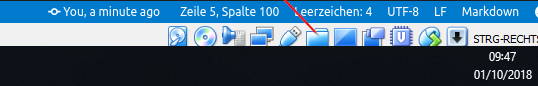
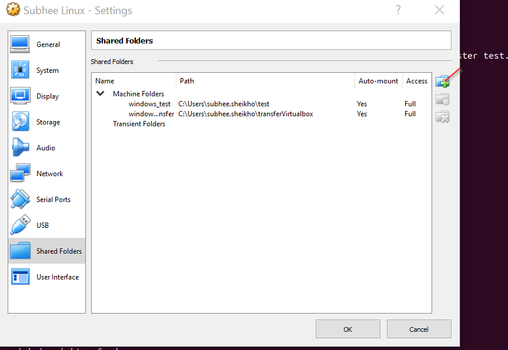
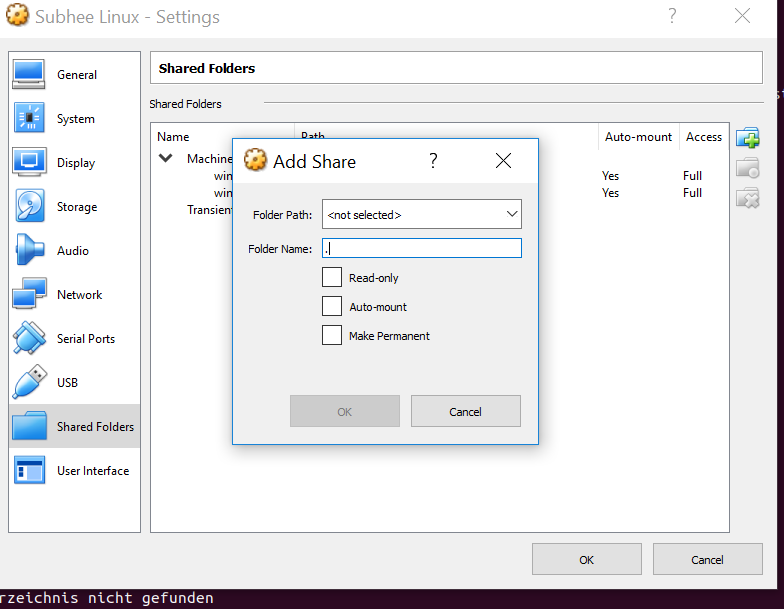
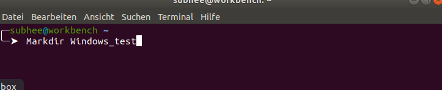
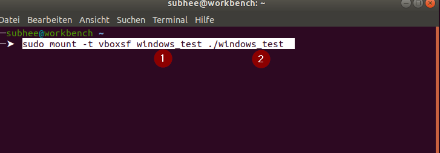

# Wie kann man ein Folder von Windows mit linux verbinden

1 . wenn man Z.B Dokument Folder oder irgendein von windwos mit linux verbinden

 ***Hinweise***  Das könnte gefährlich sein, wenn man etwas mi ubuntu falsch macht oder man löscht wird unser Folder von Windows auch weg.

2 . man kommt in linux Ubuntu .Es gibt unten recht diese Folder man klickt darau  .

# Nachdem  Klicken bekommt man solche Fenster 

# Dann drückt man auf angezeigtes Folder und bekommt man diese Fenster

* Folder Path muss mann der pfad von windows angeben.
* Folder Name Mus man ein Name angeben.

3 . Man geht zu Ubuntu und man liegt ein neu Verzeichens mit Dieses Befehl `mkdir` 

4 . Bis jetzt hat es noch nicht verbunden .Man mus auf ein Befehl ausführen .Damit es als `root` angezeigt wird.

* 1 Der Name ,den man bei foto Drei `Folder Name` angegeben hat
* 2  Der Name ,den man bei Schritt drei Mit Befehl ` mkdir` angegeben hat.
hhh