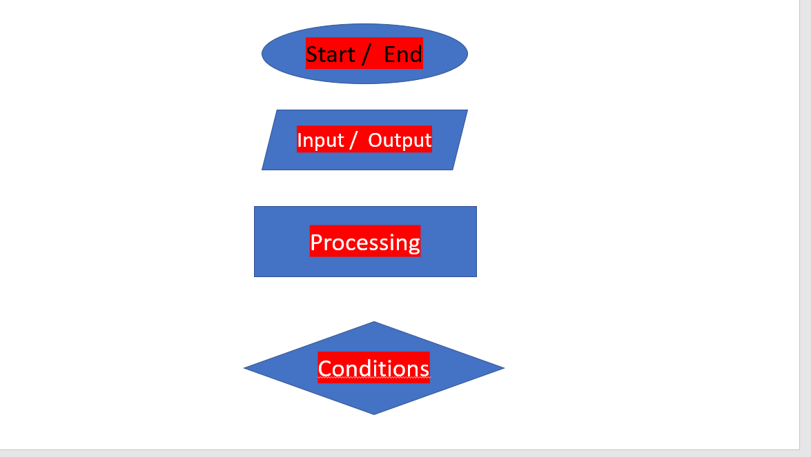

#  Programmiere Sprache Java  zu lernen

* **flow chart** ist ein Algoritmus .Es ist wichtig (Ein Plan machen) bevor man Anfang eines Programmes zu schreiben.

> Dieses Foto zeigt uns wie kann man mit Start und End und So weit.Man kann Algoritmus mit diesem Foto beschreiben.

# Java Data Type

* Was ist Data Type ? Data  Type  sind  Typen, die eigen speicher Platz haben, je nach Typen. die man verwendet.

| Data Type     |Kapazität                 |
| :------------ | :-----------             |
| byte          | von -128 bis 127         |
| short         | von -32,768 bis 32,767   |
| int           | von -2^31 bis 2^31 -1    |
| long          | von -2^63 bis 2^3 -1     |
| float         | von 1.40129846432481707e -45 bis 3.40282346638528860e +38 (Bei Positiv oder Negativ)|
| char          | Nur ein Zeichen oder Buchstabe        |
| string        |     man kann  mit ein Text Schreiben  |
| boolean       |  false und true                       |

# Assignment Operators
|Operators  | Erklärung                                                  |
| :-----    | :------                                                    |
| **=**     |    Nummer1 = 2 oder Subhee = Student                       |
| **+=**    |  Nummer1 = 5 und Nummer2 = 10 (Nummer1 **+=** Nummer2 = 15)|
|**-=**     | Nummer1 = 5 und Nummer2 = 10 (Nummer1 **-=** Nummer2 = 5)  |
|***=**     | Nummer1 = 5 und Nummer2 = 10  (Nummer1 ***=** Nummer2 = 50)|
|**/=**     | Nummer1 = 20 (Nummer1  **/=** 5 = 4)                       |
|**%=**     | Nummer1 = 10 (Nummer1 **%=** 3 = 1 Nur bleint die Rest)    |