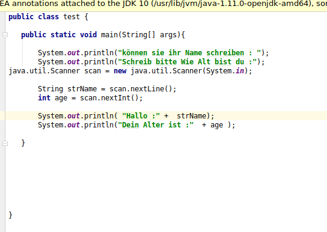
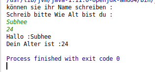
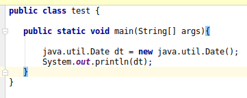
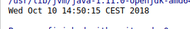
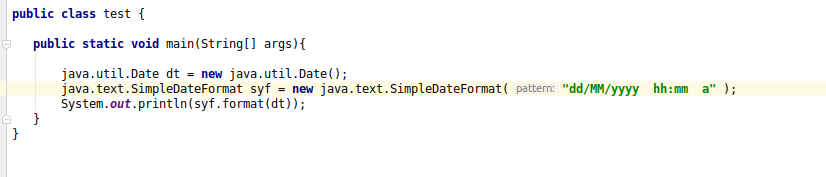

#  Programmiere Sprache Java  zu lernen

* **flow chart** ist ein Algoritmus .Es ist wichtig (Ein Plan machen) bevor man Anfang eines Programmes zu schreiben.

> Dieses Foto zeigt uns wie kann man mit Start und End und So weit.Man kann Algoritmus mit diesem Foto beschreiben.

## Java Data Type

* Was ist Data Type ? Data  Type  sind  Typen, die eigen speicher Platz haben, je nach Typen. die man verwendet.

> **Hinweise** : Wenn man **long** variabel benutzt und der Variabel ist groß ,mss man so Machen `long a = 12739746499200l ` . Mann muss am Ende **L** fügen ,Sowol auch mit `float` man muss am Ende **f** Fügen.

| Data Type     |Kapazität                 |
| :------------ | :-----------             |
| byte          | von -128 bis 127         |
| short         | von -32,768 bis 32,767   |
| int           | von -2^31 bis 2^31 -1    |
| long          | von -2^63 bis 2^3 -1     |
| float         | von 1.40129846432481707e -45 bis 3.40282346638528860e +38 (Bei Positiv oder Negativ)|
| char          | Nur ein Zeichen oder Buchstabe        |
| string        |     man kann  mit ein Text Schreiben  |
| boolean       |  false und true                       |

## Assignment Operators 

|Operators  | Erklärung                                                  |
| :-----    | :------                                                    |
| **=**     |    Nummer1 = 2 oder Subhee = Student                       |
| **+=**    |  Nummer1 = 5 und Nummer2 = 10 (Nummer1 **+=** Nummer2 = 15) Mit dieser Opration kann man auch String mit int verbinden |
|**-=**     | Nummer1 = 5 und Nummer2 = 10 (Nummer1 **-=** Nummer2 = 5)  |
|***=**     | Nummer1 = 5 und Nummer2 = 10  (Nummer1 ***=** Nummer2 = 50)|
|**/=**     | Nummer1 = 20 (Nummer1  **/=** 5 = 4)                       |
|**%=**     | Nummer1 = 10 (Nummer1 **%=** 3 = 1 Nur bleint die Rest)    |

## Wichtigesten Befehle 

* **final** wenn ein variabl fest ist ,benutzt man es.
> Beispiel wenn jemand in Syrien geburen ist; hat nur ein wahl,dass er dort geburen nicht irgendwo .Dann kann man folgende Machen ` final string Subheesgeburt = "Syrian";`.

## Wie kann der Benuzer oder End user etwas in Programm schreiben?

* Man kan in **main** Methode ein Objekt erzugen die so geschriben wird ` Java.util.Scanner var = new Java.util.Scanner(System.in);`Danach wir können diese difiniern **Z.B**`Strin Subhee = var.nextline();` und wir printen es mit 'System.out.println("Hallo" + var );`

> Hinweise: Jede Data type hat eigene nextline und nextint.

* Wenn wir diese cod geschrieben haben, bekommen wir als ergebnis in konsol das.

## wie kann man Datum und Zeit erzeugen?

* man geht in **main** Methode und schreibt so `java.util.Date dt = new java.util.Date ();`

Danach kann man **dt** printen.

* wir bekommen die Zeit und Datum als Ergebnis folgende.

* Aber man kann mit datum auch spielen Z:B wenn ich nur Zeit Bruche oder Nur Datum .Es geht folgende.
 
 > Hiweise: `dd` das bedeutet nur Tag `MM` das bedeutet nur Monat 'yy'das ist Year `hh` Uhr `MM` Minuten `ss` Sekunden `a`Abend oder Morgen.

.

## boolean

* **!** dies macht immer die umkehr **Z.B**
`Boolean a = true;`
wir möchten es printen `System.out.println(a);`
Das Ergebnis ist **true**

Aber wenn wir mit **!** drucken `System.out.println(!a);`
Das Ergebnis ist **false** 

## Vergleichungszeichens

* **==**   and  **>=**  and  **<=**  and  **!=**

>`int a = 5   int b = 10 
System.out.prinln(a == b);`
Das Ergebnis ist **false**
System.out.println(a <= b);
Das Ergebnis ist **true**
System.out.println(a >= b);
Das Ergebnis ist **false**
System.out.println(a != b);
Das Ergebnis ist **true**
wenn int a = 5 und int b = 5;
System.out.println(a == d);
Das Ergebnis ist **true**

## Conditional Operator

  |         |    And   |          |
  | :------ | :--------| :-----   |
  | true    |  true    | **true** |
  | false   | true     |   false  |
  | true    | false    |  false   |
  | false   | fals     | false    |

|         |    OR     |          |
| :------ | :------   | :-----   |
| true    |  true     | true     |
| false   | true      | true     |
| true    | false     | true     |
| false   | false     | **false**|

|           |  NOT     |       |
| :----     | :-----   | :-----|
| **NOT**   |  true    | false |
| **NOT**   | false    | true  |