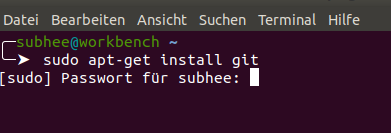
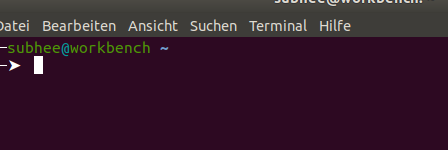
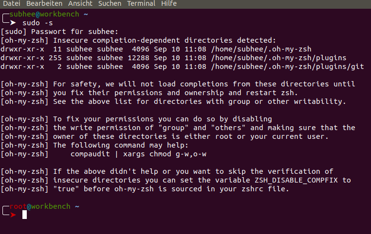
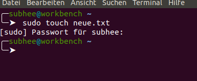
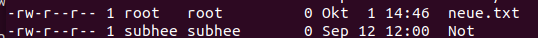

# Linux

## Wichtige Befehle
* **Instllation**: Man kann unter Ubuntu mit diesem Befehl`Sudo apt-get install Name der Paket` jede Pakete installieren.>**Hinweise** Man muss das Passtwort angeben.

* Befehl `cat` kann inhalt einr Datei auf dem Bildschirm ausgegeben.Sowohl auch  kann es zwei Datei zu einzelnen zu verbinden.
>**Beispiel** Eine Textdatei an einer andere anzuhängen benutzt man Folgende``cat datei1 >> datei2`` Um aus zwei Dateineine neue Datei zu erstellen es lautet so `cat datei1 datei2 > datei-neue.txt`

* Ein Wichtiges Befehl ist `sudo` .Man kann mit dieses Befehl zu root wechselen
>**Hinweise** wenn man als root arbeiten möchtet ,muss man damit vorsichtig sein .Da kann mit klein Fehler dein System kaputt gehen.
`sudo -s` wechselt von Normal Benutzer zu root unter Ubuntu.Normal Bentuzer lautet so.

root Benutzer Lautet folgende.

* Man kann mit befehl `exit` zurück wechelen.

* Wenn man eien Datei direkt mit root anlegt muss man folgende machen.`sudo tuoch datei name`

>Diese neue Datei haben wir als Root angelegt.

ww

