# Linux

## Wichtige Befehle
* **Instllation**: Man kann unter Ubuntu mit diesem Befehl`Sudo apt-get install Name der Paket` jede Pakete installieren.>**Hinweise** Man muss das Passtwort angeben.

## cat
* Befehl `cat` kann inhalt einr Datei auf dem Bildschirm ausgegeben.Sowohl auch  kann es zwei Datei zu einzelnen zu verbinden.
>**Beispiel** Eine Textdatei an einer andere anzuhängen benutzt man Folgende``cat datei1 >> datei2`` Um aus zwei Dateineine neue Datei zu erstellen es lautet so `cat datei1 datei2 > datei-neue.txt`

## sudo
* Ein Wichtiges Befehl ist `sudo` .Man kann mit dieses Befehl zu root wechselen
>**Hinweise** wenn man als root arbeiten möchtet ,muss man damit vorsichtig sein .Da kann mit klein Fehler dein System kaputt gehen.
`sudo -s` wechselt von Normal Benutzer zu root unter Ubuntu.Normal Bentuzer lautet so.

root Benutzer Lautet folgende.

* Man kann mit befehl `exit` zurück wechelen.

* Wenn man eien Datei direkt mit root anlegt muss man folgende machen.`sudo tuoch datei name`

>Diese neue Datei haben wir als Root angelegt.

## alias

* Mit diesem Befehl kann mann lange zeil abkurzen .Damit man nicht viel schreibt und es wird schnell. Es ist einfach **Zeit** nur difinieren statt **"date +%H:%M:%S"**

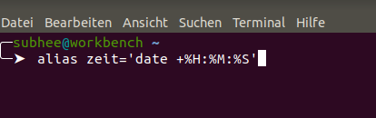

* Hier gibt man nur Zeit und zeigt Zeit.

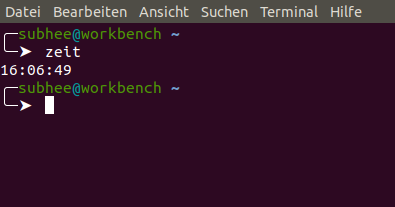

## greb

* greb lasst sichDatein nach bestimmten Textstücken durchsuchen.
Ich habe eine Datei schon angelegt ,die hei?t nur `p` und ich lese sie mit cat .Mann bekommt inhalt.

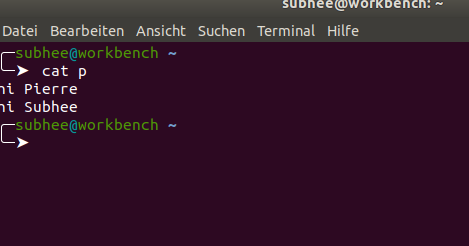

* wenn man diese Befehl `greb -i pierre*` benutzt bekommt man all Pierre und **i** bedeutet ignoriere groß und klein Schreibsschrieft.

* wenn ich nach Pierre Suche genau , kann ich `greb` verwenden.
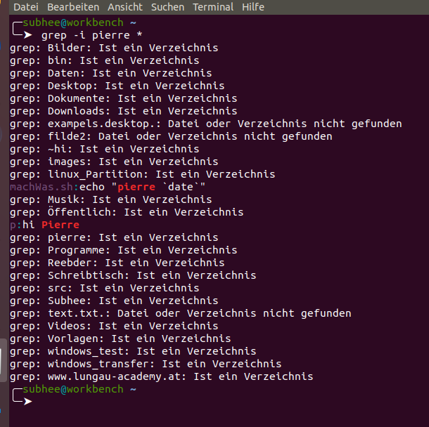

* Man kann mit diesem Befehl  `find -name "*.html" | xargs grep -i pierre ` nach **html** in ganz system suchen.
 
 ## chmod

 1. Methode **ugoa**

  | U | Steht für den Bezitzer (User) |
  | :------- | :--------------------- |
  | O | Steht für Anderen (other)     |
  | A | Steht für (alle)              |
  | g | Steht für die (Gruppe)        |

* Dieses Befehl gibt den Datein Recht.

> Aie Rechte **r** Steht für `lessen`, **w** steht für `schreiben`,**x**  steht für `Ausführen`  

> Beispiel  Wir wollen dem Besitzer Schreibberechte nehmen . Lautet so `chmod u-w dateiname`Nachder Ausführung kann dem Besitzer nur lesen. bleibt **r** Recht. 

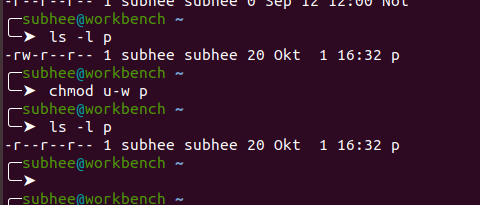

> Man kann auch mit plus die Recht wieder geben  .Das Befehl lautet folgende `hmod u+w dateiname`

2. Methode **numerische**

* Es gibt für jeder Recht ein Zahl .

 | 1 |   für Ausführen   | 
 | :------| :-----       |
 | 2 | für Schreiben     |
 | 4 | für Lesen         |

 > Beizpiel chmod 744 dateiname  **entspricht**  chmod a+r,u+wrx Der Besitzer kann lesen,schreiben und Ausführen .und Anderen können nur lessen.

 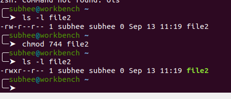

## zip, unzip

* mit **zip** können mehreren Datein zu einem **Komprimierten**  
Datei-Archiv gebündelt.

* Mit unzip Dateiname wird die Datei wieder entpackt.

|  Erklärung |   Befehl             |
| :----------| :-----               |
|Datein als zip archiv komprimieren |`zip Archiv.zip datei1,datei2,datei3,..`|
|Kompletten Ordner komprimieren | `zip -r Archiv.zip Ordner1,Ordner2` |
|zip Archiv entpacken | `unzip -1 Archiv.zip` |

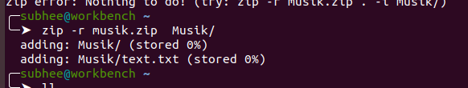

* entpacken mit unzip.

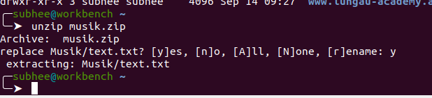

 ## mount 

 Bevor man sich mit dem Begrief **monut** muss man sich mit Dateienverwaltung unter Linx beschäftigen.Linux hat **nur ein c:\ , was bei linux root ist** Hingegen bei Windows gibt es ` "C:\" , "D:\" ," E:\" ` .

 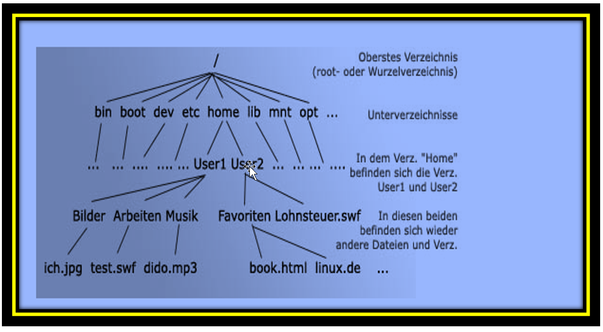

 > **Bild Erklärung**: **bin** Verzeichnis bfinden sich nur die wichtige Programme, die immer von überall verfügbar sein  mussen
 Z.B (Shell)
 **boot** Verzeichnis hier sind Datein drin ,was man braucht ,um die Rechner hochzufahren
**dev** Verzeichnis ehr eine Schnittstelle zu Hardwaressystem.
**etc** Verzeichnis hier findet man alle wichtige Konfigurationsdatein  mit dem man System anpassen kann.
**lib** Verzeichnis Man soll mit diesem Verzeichnis vorsichtig sein, darin befindet sich die Grundlagen Funktionsbibliothek 
**mnt** Verzeichnis In diesem Verzeichnis sind Temporer eingehangene Dateissysteme.
**opt** Verzeichnis in dem sämtliche Zusatzprogramme installiert werden, die nicht unter eine freien Lizenz stehen. Der Hauptvorteil gegenüber einer Installation im eigenen **Homeverzeichnis** ist die Möglichkeit ;Systemweit(durch alle auf dem Rechner vorhandenen Benutzer )auf die dort installierten Programme zugreifen zu können.

* Beispiel **CD** mounten.

1. Man muss als root anmelden.Damit man mit mount arbeiten kann.

2. man soll einen Ordner in `mnt` anlegen.Das Befehl lautet folgende `mkdir /mnt/monut_CD`

3. man muss mit diesem Befehl ` mount /dev/cdrom /mnt/mount_cdrom`

4.man kann das CD inhalt anzeigen mit diesem Befehl ` ls /mnt/name des Ordner ` 

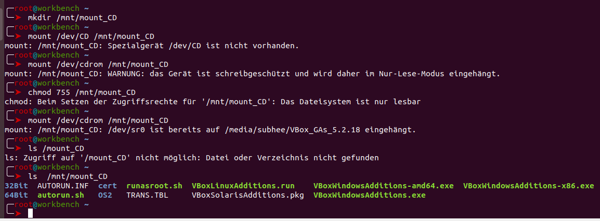

## xargs 

* Mit `xargs` können Ergebnisse eines shell_Programms als Argumente eines anderen shell_Programms verwendet werden .Dies ist beispielsweise bei der Kombination von **find** und **grep** nüzlich,um die von **find** gefundenen Dateinamen nicht unmitelbar als Eingabe Test, sondern als Zieldatein nach bestimmten Mustern zu durchsuchen.
> Das untere Bild zeigt uns , dass wir ein  ordener als **test** angelegt und habe mit paaren Zeilen ausgefühlt.Dann können wir mit **find** und **grep** probieren 

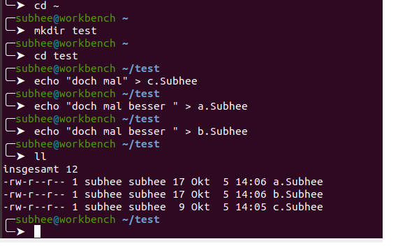

* Ich habe hier zwei Befehl benutzen, die beiden geben gleiche Ergebnisse
`find ./ -name "*.Subhee" -type f | xargs` 
`find ./ -name "*.Subhee" -type f `

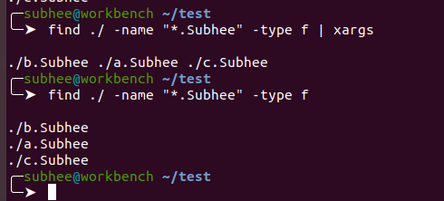

* Aber wenn Man  nach einer bestimmten sache suchen möchte, verwendet mann dieses Befehl. `find ./ -name "*.Subhee" _type f |xargs grep besser` Hier suchen wir nur Zeilen Mit diesm Wort **besser**

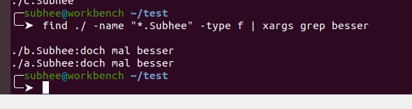

* Man kann auch mit diesem Befehl die inhalt dieses Verzeichnis löschen. 
`find ./ _name "*.Subhee" _type f | xargs grep rm`

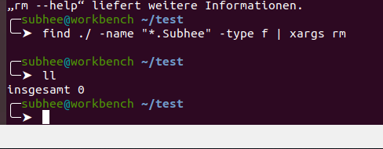

## Ein Packet entpacken.

* Mit diesem Befehl `tar -xvf Datei.tar.gz` kann man ein Packet entpacken .
